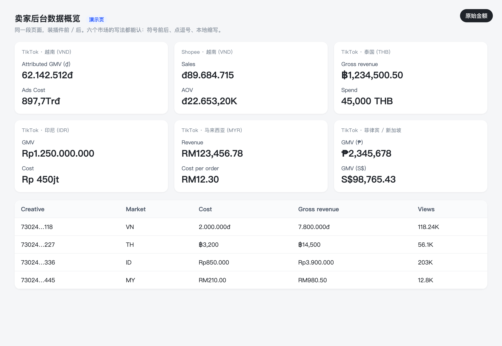
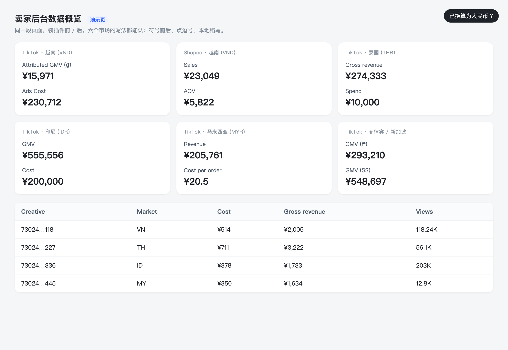

<div align="center">

# KANS Vietnam Ops Toolkit · KANS 越南运营工具箱

**Automation for running a TikTok Shop in Southeast Asia: Feishu bot & CLI, GMV Max creative ROI monitor, host ranking, multi-market FX browser extension. Battle-tested on the KANS Vietnam shop, fully config-driven.**

[中文](README.md) | English


[](https://github.com/njh20030605-code/kans-vn-ops-toolkit/actions/workflows/test.yml)


</div>

> No credentials (Feishu App Secret, TikTok session, `.env`), internal metric documents, campaign IDs or colleague details are stored here — `sync-from-desktop.sh` runs `scrub.sh` on every sync. See each sub-project's *First-time setup*. Sub-project docs are in Chinese; this page is the English entry point.

<p align="center">
   
</p>
<p align="center"><sub>FX extension: the same seller-center page before / after. Counts such as views are left alone.</sub></p>

## Who is this for

| You are… | Go to | It solves |
|---|---|---|
| **Ads / media-buying intern** | [`roi-monitor/`](roi-monitor/) · [`feishu-api/kans-board`](feishu-api/kans-board/) · [`feishu-api/creative-exclusion`](feishu-api/creative-exclusion/) · [`feishu-api/intern-workflow`](feishu-api/intern-workflow/) | Hourly auto-scan of low-ROI creatives, one-click copy of creative IDs back into TikTok's bulk filter, exclusion registry, daily task board that resets itself |
| **Colleague running a 24/7 Windows box** | [`roi-monitor-win/`](roi-monitor-win/) | Same scanner, double-click `.bat` files, output lands on the Desktop |
| **Creator BD / ad-code hand-off** | [`feishu-api/followup-sync.js`](feishu-api/followup-sync.js) | Records with an ad code but no owner flow into a workbench automatically; rejection notes are written back to your table |
| **Livestream ops / host management** | [`host-ranking/`](host-ranking/) | One click → trilingual (ZH / EN / VI) daily + month-to-date host GMV ranking in Excel |
| **Anyone reading a SEA back-office** | [`fx-extension/`](fx-extension/) | Live local-currency → CNY / USD conversion across six markets in TikTok Shop and Shopee seller pages |
| **Lead / anyone asking about metric definitions** | [`feishu-api/bot.js`](feishu-api/bot.js) · [`feishu-api/kb/`](feishu-api/kb/) | @My Claude in Feishu; answers come only from the curated knowledge base |
| **Engineer taking over maintenance** | *First-time setup* in each README + `sync-from-desktop.sh` | Credentials, launchd jobs, source sync |

## Projects

| Directory | What it is | Stack | Runs as |
|---|---|---|---|
| [`feishu-api/`](feishu-api/) | Feishu Open Platform CLI + the "My Claude" Feishu bot + 4 resident sync jobs (creative exclusion table, ad follow-up workbench, intern daily board, low-ROI dashboard) | Node.js · Lark SDK · Claude | launchd |
| [`roi-monitor/`](roi-monitor/) | GMV Max high-cost / low-ROI creative monitor: hourly **read-only** scan of TikTok Ads, hits go to xlsx / Feishu Bitable + push notifications | Node.js · Playwright | macOS launchd |
| [`roi-monitor-win/`](roi-monitor-win/) | Windows build of the same scanner, trimmed for an always-on PC | Node.js · Playwright | Windows |
| [`host-ranking/`](host-ranking/) | Host ranking generator: reads a published Google Sheet, merges several livestream rooms, outputs trilingual Excel | Python · openpyxl · PyInstaller | Desktop app / exe |
| [`fx-extension/`](fx-extension/) | Chrome / Edge MV3 extension converting VND / THB / IDR / MYR / PHP / SGD to CNY or USD on TikTok Shop & Shopee seller pages, market auto-detected by domain | Browser extension | Load unpacked |

## How the pieces fit

```
TikTok Ads ──(roi-monitor, hourly, read-only)──▶ Feishu Bitable "hit log"
                                                       │
                   feishu-api/kans-board every 15 min ─▶ "Today / Last 7 days" dashboards (creative IDs paste straight back into TikTok's bulk filter)
                                                       │
Interns log creatives ─▶ "Creative exclusion" table ◀── feishu-api/creative-exclusion every 3 min: fill shop, de-dup, push cards
BD fills ad codes     ─▶ "Ad follow-up workbench" ◀── feishu-api/followup-sync every 30 s, two-way
@My Claude in a group ─▶ feishu-api/bot.js reads local kb/ + chat history + images ─▶ answers with Claude / reads & writes cloud docs
```

## Conventions

- FX: ₫3,860 ≈ ¥1; USD × 6.8 = RMB
- Low-ROI creative: same-day normalised cost ≥ ¥70 and ROI < 2; red alert: cost ≥ ¥200 and ROI < 1
- Attribution: TikTok 7-day vs TTMS O5A 30-day are never mixed
- The full definitions live only in the local `kb/` folder (the bot's single source of truth); the public [`feishu-api/kb/`](feishu-api/kb/) keeps the format guide and an example

## Supported markets

Nothing hardcodes Vietnam. Market parameters live in one place per tool.

| Market | Currency | ≈ per 1 CNY | Timezone | TikTok Seller Center |
|---|---|---|---|---|
| Vietnam VN | VND ₫ | 3,891 | UTC+7 | seller-vn.tiktok.com |
| Thailand TH | THB ฿ | 4.5 | UTC+7 | seller-th.tiktok.com |
| Indonesia ID | IDR Rp | 2,250 | UTC+7 | seller-id.tiktok.com |
| Malaysia MY | MYR RM | 0.6 | UTC+8 | seller-my.tiktok.com |
| Philippines PH | PHP ₱ | 8.0 | UTC+8 | seller-ph.tiktok.com |
| Singapore SG | SGD S$ | 0.18 | UTC+8 | seller-sg.tiktok.com |

Where to change it: the `market` block in `roi-monitor/config.json` (templates in `roi-monitor/markets.example.json`), `currency` / `local_lang` in `host-ranking/config.json`, and one block in `fx-extension/markets.js`.

## Adopt it for your own shop in 10 minutes

Every business parameter lives in a config file; no code changes needed. Each directory ships a `*.example.json` — copy it, drop the `.example`, fill in your values:

| Step | What | File |
|---|---|---|
| 1 | Create a Feishu custom app with cloud-doc / Bitable / message scopes; store its App Secret locally | `feishu-api/设置凭证.command` → `~/.feishu/credentials.json` |
| 2 | Tenant domain, the one user the bot answers, default output folder, Bitable IDs of the follow-up workbench and creative-exclusion table | `feishu-api/settings.example.json` → `settings.json` |
| 3 | Creative exclusion: shop list + campaign→shop map; `rebuild.js` creates the table for you | `feishu-api/creative-exclusion/config.example.json` → `config.json` |
| 4 | Low-ROI dashboard: the Bitable the monitor writes into | `feishu-api/kans-board/config.example.json` → `config.json` |
| 5 | Intern daily board: intern list, shops, table IDs; `create-base.js` builds it | `feishu-api/intern-workflow/config.example.json` → `config.json` |
| 6 | ROI monitor: thresholds, FX rate, brand name for notification titles, channels; which campaigns to watch | `roi-monitor/config.json` · `campaigns.example.json` → `campaigns.json` · `.env.example` → `.env` |
| 7 | Host ranking: Google Sheet ID, room tab keywords, FX rate, column indexes | `host-ranking/config.example.json` → `config.json` |
| 8 | FX extension: works as-is; add a country by editing one block in `markets.js` | `fx-extension/markets.js` |

## Quick start

```bash
# Feishu CLI
cd feishu-api && npm install && node feishu.js selftest

# ROI monitor (macOS)
cd roi-monitor && npm install && npx playwright install chromium && npm run login && npm run scan

# Host ranking
cd host-ranking && pip install -r requirements.txt && python3 main_app.py
```

Windows EXE for `host-ranking` is built by GitHub Actions (`.github/workflows/build-host-ranking-windows.yml`) — download it from the Actions artifacts.

## Keeping the repo in sync

Sources are edited in their Desktop folders. Run `sync-from-desktop.sh` to pull the latest code in (dependencies, logs, data and credentials are excluded), then commit and push.

## Contact

Questions, adoption help, or you also automate TikTok Shop ops:

- WeChat: **Anyway77777777**
- GitHub: [@njh20030605-code](https://github.com/njh20030605-code)

## License

MIT — see [LICENSE](LICENSE).
